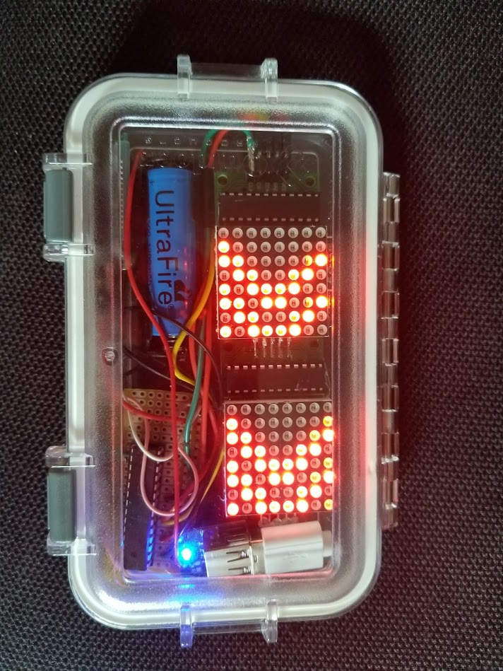
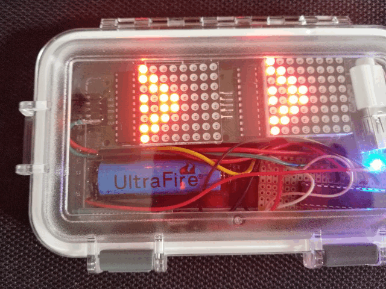
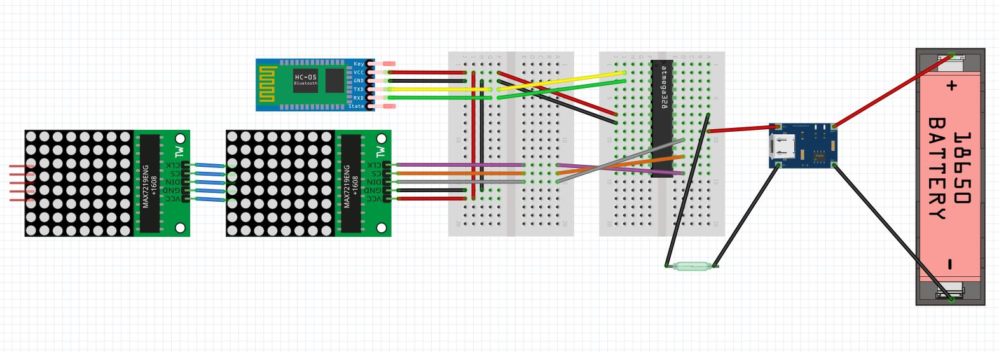
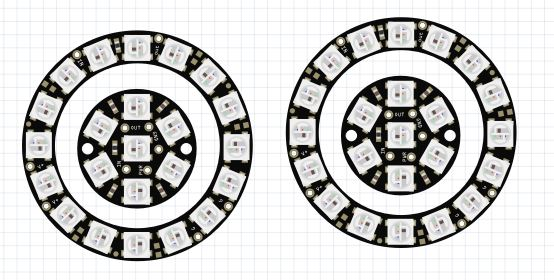
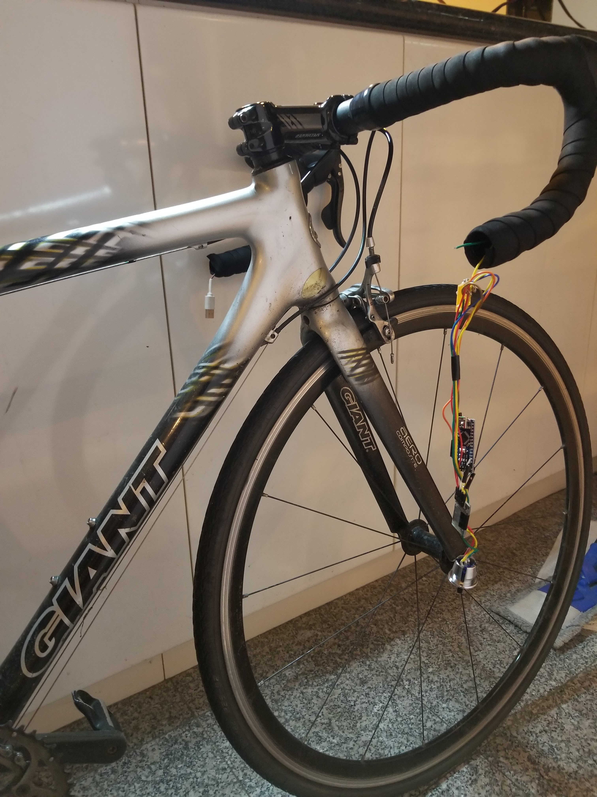
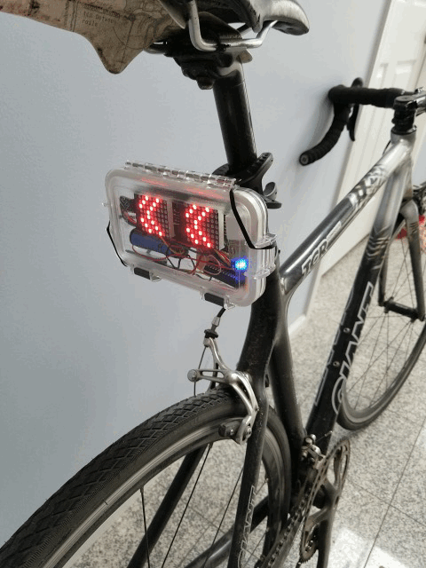
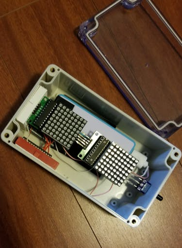

# Bluetooth-enabled bicycle turn signal
A turn signal for bikes!

**Motivation**

After commuting to work every day on my bicycle, I decided that I needed a better way to signal my turns. Sticking my arms out can be dangerous, especially if you're riding downhill in the rain (as is common in Vancouver).

I had recently got an Arduino and wanted to embark on my first project, so I decided to kill two birds with one stone!

I wanted something waterproof that I can use in the rain, and something detachable so it wouldn't get stolen, it needed to be detachable/wireless.

The plan was to have a couple of switches embedded into the handlebars (for power and for turn signal), use a Bluetooth transmitter (HC-05) for communication, and have an Arduino Nano to control it all with an 18650 lithium-ion battery (controlled with a 134N3P chip) for power. On the other end of the bike, there are two 8x8 LED matrices controlled by MAX7219 controllers, a Bluetooth receiver (HC-05), an ATMEGA328P chip to control all the components and an 18650 (or 14500) lithium-ion battery for power. I also added a Qi wireless charging receiver to charge the battery without opening the lights enclosure.

**Action shots**

Here's a gif of it in action:

A closeup of the updated slim case with all the gubbins:

If you don't like my boring arrows, make any indicator animation you want using my 8x8 LED byte generator found on my [LED_byte_matrix_generator repo](https://github.com/simonwongwong/LED_byte_matrix_generator)

Full parts and tools requirements can be found on the [hackster.io page](hackster.io/simonwongwong/bluetooth-enabled-bicycle-turn-signal-2f4f5d)

# Wiring diagrams

Diagram for handlebar/controller:

Diagram for lights enclosure:

# Setup instructions:

* Set up the HC-05 Bluetooth modules to pair with each other using a master-slave setup [(instructions)](https://howtomechatronics.com/tutorials/arduino/how-to-configure-pair-two-hc-05-bluetooth-module-master-slave-commands/)
  - Other Bluetooth modules with similar functionality can be used
* Upload code for the [lights](code_for_lights.ino) and the [handlebars](code_for_handlebars_controller.ino) to the Arduino Nano (or any other ATMEGA328P based chip) 
* Wire everything up according to the wiring diagrams
  - if using a reed switch to control power to the lights, you'll need a magnet

# Variation/upgrade ideas

* **Reed switch to control power to the lights**. If your case is too slim for a toggle switch (like my latest iteration) or you're worried about the waterproof-ness of the case, a reed switch could be used.
  - New wiring diagram:
   
  - A magnet attached to the light mount can turn the lights on and the lights can be turned off by taking the lights off the mount
  - Or a second magnet can be used to change the flux path and open the reed switch like so:
   
* **Neopixel rings and jewels as a turn signal**, like a car with the outer ring in red and the inner jewel lit up amber and flashing when turning

   
* **Add an accelerometer** to detect slowing down and display a slowing down animation or flash amber lights

# Pictures of the build

Internals:

Note: Bluetooth module, Arduino Nano and PCB separated from battery by a long ~1m cable

Image of handlebar batteries:

Testing lights before gluing everything and closing the case:

Mounted on my bike:

Message me for more details if you want to make one for yourself

Thanks for reading!

(OLD PICTURES BELOW)

Lights enclosure with breadboards wired up:

Qi wireless charger attached to battery pack:

Fully assembled:

